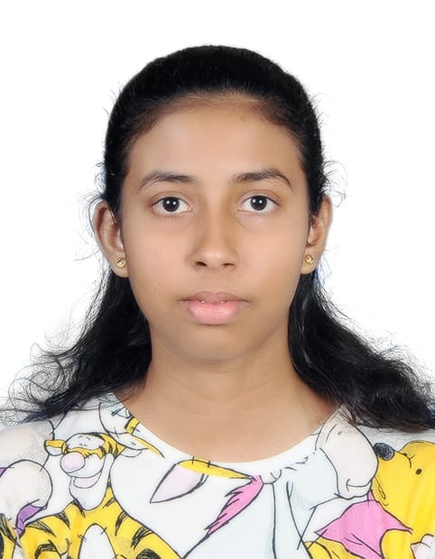

# Hi, I'm Lithmi Sehathna

I’m Lithmi Sehatna, an IT undergraduate at the University of Colombo with a growing interest in technical support and simple, user-friendly web pages. I enjoy solving practical problems, documenting clear how-to steps, and creating clean visuals. I’m comfortable with Microsoft Office, basic Python/HTML, and Canva, and I’m continuously improving my troubleshooting, communication, and teamwork skills.

Welcome to my e-Portfolio.

- [Education](education.md)
- [Work Experience](work.md)
- [Other Qualifications](qualifications.md)
- [Projects](projects.md)
- [Skills](skills.md)
- [Hobbies](hobbies.md)
- [Contact](contact.md)

**Download my résumé:** [resume.pdf](resume.pdf)

